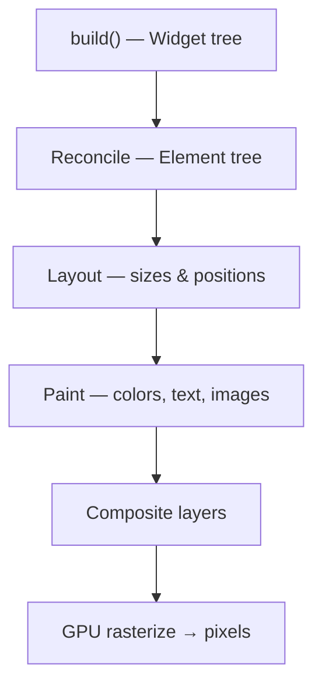
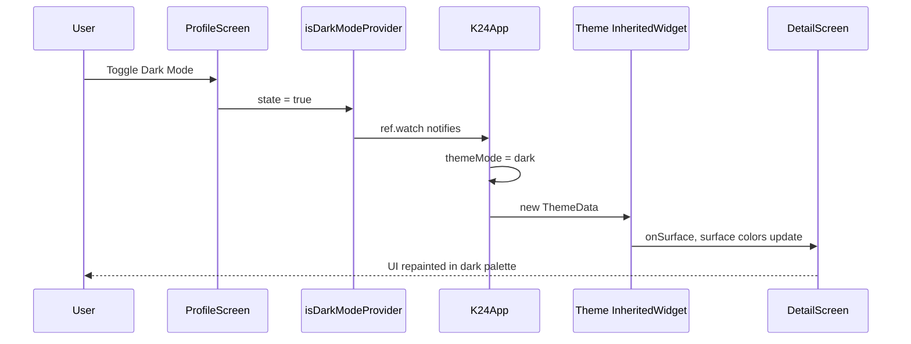

# UI and Rendering

This document explains how Flutter turns Dart code into pixels on screen in the **K-24 Pharmacy** app (`k24_mvp`). It focuses on the widget tree, `home_screen.dart`, `detail_screen.dart`, our `StatelessWidget` patterns, and how dark mode updates the whole app instantly.

For routing, see [1_Routing_and_Architecture.md](./1_Routing_and_Architecture.md).  
For Riverpod, see [2_State_Management_Riverpod.md](./2_State_Management_Riverpod.md).

---

## Table of Contents

1. [Big Picture: UI in Our App](#big-picture-ui-in-our-app)
2. [What: The Widget Tree](#what-the-widget-tree)
3. [What: StatelessWidget vs StatefulWidget](#what-statelesswidget-vs-statefulwidget)
4. [How: Flutter Paints Pixels (Under the Hood)](#how-flutter-paints-pixels-under-the-hood)
5. [How: Dark Mode Updates the Whole App](#how-dark-mode-updates-the-whole-app)
6. [Case Study: home_screen.dart](#case-study-home_screendart)
7. [Case Study: detail_screen.dart](#case-study-detail_screendart)
8. [Our StatelessWidget Usage](#our-statelesswidget-usage)
9. [Why & Why Not: ConsumerWidget vs StatefulWidget Everywhere](#why--why-not-consumerwidget-vs-statefulwidget-everywhere)
10. [When & Where: Rebuilds and Logic Boundaries](#when--where-rebuilds-and-logic-boundaries)
11. [Examples: Lego Blocks and the Rendering Pipeline](#examples-lego-blocks-and-the-rendering-pipeline)
12. [Tips for Developers Working on This Project](#tips-for-developers-working-on-this-project)

---

## Big Picture: UI in Our App

In Flutter, **everything on screen is a widget**. Our app does not draw buttons and text manually with canvas calls in each screen. Instead, screens **describe** UI as a tree of widgets; Flutter's engine **builds, lays out, and paints** that description every frame when needed.

```
Dart widgets (what we write)
        ↓
Flutter framework (build, layout, paint)
        ↓
Skia / Impeller graphics engine
        ↓
GPU
        ↓
Pixels on your phone or browser
```

**Our UI stack:**

| Layer | Examples in K-24 |
|-------|------------------|
| **App shell** | `K24App`, `MaterialApp.router`, themes |
| **Screens** | `HomeScreen`, `DetailScreen`, `CartScreen`, … |
| **Reusable widgets** | `AppLogo`, `ProductImage`, `EmptyState`, `_ProductCard` |
| **Design tokens** | `Theme.of(context)`, `kK24Green`, Material 3 `colorScheme` |
| **Shared state driving UI** | Riverpod (`productProvider`, `isDarkModeProvider`, …) |

---

## What: The Widget Tree

The **widget tree** is the hierarchical structure of widget objects describing your UI at a moment in time. It is a **configuration blueprint**, not the pixels themselves.

A simplified tree when viewing `DetailScreen`:

```
MaterialApp.router
└── GoRouter shell
    └── DetailScreen (ConsumerWidget)
        └── Scaffold
            ├── AppBar
            │   ├── IconButton (back)
            │   └── IconButton (favorite)
            ├── ListView
            │   ├── ProductImage (StatelessWidget)
            │   ├── Text (product name)
            │   ├── Row (badge + price)
            │   └── ExpansionTile × 3
            └── BottomAppBar
                └── FilledButton ("Add to Cart")
```

**Important properties of widgets:**

| Property | Meaning |
|----------|---------|
| **Immutable** | Once built, a widget object's fields do not change — you create a *new* widget to "change" UI |
| **Cheap to recreate** | `build()` can run often; constructing widgets is lightweight |
| **Declarative** | You describe *what* UI should look like for current data, not *how* to mutate old UI |

When cart data, theme, or search text changes, Flutter **rebuilds** parts of the tree — `build()` runs again and returns a fresh widget description. The framework diffs it against the previous frame and updates only what changed.

### Three trees (beginner-friendly mental model)

Flutter actually maintains three parallel structures:

| Tree | Role | Analogy |
|------|------|---------|
| **Widget tree** | Configuration ("use green, 16px padding") | Lego instruction booklet |
| **Element tree** | Lifecycle, parent-child links, `State` objects | Assembled Lego structure on the table |
| **RenderObject tree** | Sizes, positions, painting | Physical blocks with exact measurements |

You mostly write **widgets**. Flutter keeps elements and render objects in sync when widgets rebuild.

---

## What: StatelessWidget vs StatefulWidget

### StatelessWidget

A widget that **does not own mutable state** across rebuilds. All inputs come from:

- Constructor parameters (`product`, `priceLabel`, `onTap`)
- `InheritedWidget`s like `Theme.of(context)`, `MediaQuery.of(context)`

```dart
class _ProductCard extends StatelessWidget {
  const _ProductCard({
    required this.product,
    required this.onTap,
    // ...
  });

  final Product product;
  final VoidCallback onTap;

  @override
  Widget build(BuildContext context) {
    final cardColor = Theme.of(context).cardColor;
    return Material(/* ... */);
  }
}
```

If `product` or theme changes, the **parent** rebuilds and creates a new `_ProductCard` with new arguments. The widget itself does not call `setState`.

### StatefulWidget

A widget split into two classes:

1. **Widget** — immutable config (`HomeScreen`)
2. **State** — mutable fields that survive rebuilds (`_searchController`, `_selectedCategory`)

```dart
class HomeScreen extends ConsumerStatefulWidget {
  @override
  ConsumerState<HomeScreen> createState() => _HomeScreenState();
}

class _HomeScreenState extends ConsumerState<HomeScreen> {
  final _searchController = TextEditingController();
  String? _selectedCategory;

  // setState(() {}) triggers rebuild of this State's build method
}
```

**Use StatefulWidget when** the screen needs local ephemeral UI state: text field contents, selected chip, loading spinner flag, animation controller, `Timer` in splash.

### ConsumerWidget / ConsumerStatefulWidget (Riverpod extension)

| Type | Extends | Adds |
|------|---------|------|
| `ConsumerWidget` | Stateless pattern | `WidgetRef ref` in `build` |
| `ConsumerStatefulWidget` | Stateful pattern | `ref` on `ConsumerState` |

They are not separate from Stateless/Stateful — they **combine** Flutter widgets with Riverpod access. `DetailScreen` is a stateless-style screen with `ref.watch`.

### Quick comparison

| | StatelessWidget | StatefulWidget |
|--|-----------------|----------------|
| Mutable fields in widget | No | Yes, in `State` object |
| `setState` | No | Yes |
| Survives parent rebuild | N/A (recreated from props) | `State` persists |
| Our examples | `_ProductCard`, `EmptyState`, `DetailScreen` | `HomeScreen`, `LoginScreen`, `SplashScreen` |

---

## How: Flutter Paints Pixels (Under the Hood)

Flutter rendering is a **pipeline**. You do not need to manage each step, but understanding them explains lag, rebuilds, and theming.

### Phase 1 — Build

- `build()` methods run top-down (for widgets marked dirty).
- Output: a **widget tree** description.
- In our app: e.g. `HomeScreen.build` watches `productProvider`, returns `Scaffold` → `productsAsync.when(...)` → grid of `_ProductCard`.

### Phase 2 — Reconcile (diff)

- Flutter compares new widgets to previous widgets (same `runtimeType` + `key`).
- Updates the **element tree**; reuses `State` where possible.
- `const` widgets (e.g. `const AppLogo(height: 50)`) short-circuit work — Flutter knows they never change.

### Phase 3 — Layout

- **RenderObjects** measure constraints (parent passes max width/height down).
- Children report their size up.
- Example: `SliverGrid` in `HomeScreen` computes cell sizes from `maxCrossAxisExtent` and `childAspectRatio`.

### Phase 4 — Paint

- RenderObjects draw **layers**: backgrounds, text, images, shadows.
- `Theme.of(context).colorScheme.onSurface` becomes actual color values here.
- `ProductImage` triggers `Image.asset` decoding; GPU textures cache bitmaps.

### Phase 5 — Compositing

- Layers are merged (opacity, clips, transforms).
- Sent to **Skia** (or **Impeller** on newer iOS builds).

### Phase 6 — Rasterization

- GPU turns vector/layer commands into **pixels** on the display.



**Frame budget:** Mobile targets ~60 fps (~16 ms per frame). Heavy `build()` or huge lists without lazy builders can miss that budget. Our `SliverGrid` + `SliverChildBuilderDelegate` builds **only visible** product cards — a performance-conscious choice.

---

## How: Dark Mode Updates the Whole App

Dark mode is a concrete example of **InheritedWidget + Riverpod** propagating visual change app-wide without editing every screen.

### Step 1 — User toggles the switch

```dart
// profile_screen.dart
Switch(
  value: isDarkMode,
  onChanged: (value) {
    ref.read(isDarkModeProvider.notifier).state = value;
  },
),
```

### Step 2 — Provider notifies listeners

`isDarkModeProvider` updates from `false` → `true`. Every widget that **`ref.watch(isDarkModeProvider)`** is marked dirty.

### Step 3 — Root app rebuilds

```dart
// main.dart — K24App
final isDarkMode = ref.watch(isDarkModeProvider);

return MaterialApp.router(
  theme: _buildLightTheme(),
  darkTheme: _buildDarkTheme(),
  themeMode: isDarkMode ? ThemeMode.dark : ThemeMode.light,
  // ...
);
```

`K24App` rebuilds. `MaterialApp` switches active `ThemeData`.

### Step 4 — Theme propagates via InheritedWidget

`MaterialApp` inserts a **`Theme` InheritedWidget** above the navigator. Every descendant can call:

```dart
Theme.of(context).colorScheme.onSurface
Theme.of(context).textTheme.titleLarge
Theme.of(context).cardColor
```

When `themeMode` flips, **Theme's inherited data changes**. Descendants that depend on it rebuild.

### Step 5 — Screens pick up new colors automatically

Our screens rarely hardcode `Colors.white` backgrounds for body content. They use theme-aware colors:

| File | Theme-aware usage |
|------|-------------------|
| `detail_screen.dart` | `colorScheme.onSurface`, `onSurfaceVariant`, `surface`, `outlineVariant` |
| `home_screen.dart` | `colorScheme.surfaceContainerHighest`, `outlineVariant`, `onSurface` |
| `empty_state.dart` | `colorScheme.onSurface`, `onSurfaceVariant` |

**Brand green (`kK24Green`) stays constant** — only surfaces and text colors adapt.

### Why it feels instant

- No restart, no manual per-screen toggle
- One provider change → one root rebuild → Theme inheritance fans out
- Flutter repaints only dirty subtrees (not necessarily every widget if some are unchanged)



---

## Case Study: home_screen.dart

`HomeScreen` is a **`ConsumerStatefulWidget`** — it mixes **local UI state** with **shared Riverpod state**.

### Local state (Stateful — `setState`)

| Field | Purpose | Triggers rebuild via |
|-------|---------|----------------------|
| `_searchController` | Search box text | `onChanged: (_) => setState(() {})` |
| `_selectedCategory` | Filter chip selection | `onSelected` → `setState` |

Search and category filtering are **not** stored in Riverpod because no other screen needs them. Keeping them local avoids unnecessary global rebuilds.

### Shared state (Riverpod — `ref.watch`)

```dart
final isEnglish = ref.watch(isEnglishProvider);
final productsAsync = ref.watch(productProvider);
```

When Firestore products update or language toggles, `build` re-runs and `_buildProductList` gets fresh data.

### UI structure

```
Scaffold
├── AppBar → AppLogo
└── body: productsAsync.when
    ├── loading → CircularProgressIndicator
    ├── error → Text
    └── data → CustomScrollView (slivers)
        ├── Search TextField + FilterChips
        ├── Empty / not-found states
        └── SliverGrid → _ProductCard (StatelessWidget) × N
```

### Delegation to StatelessWidget

`_ProductCard` is extracted as a **private `StatelessWidget`** because:

- It is pure presentation: given `product`, `priceLabel`, callbacks → build card
- Easier to read than one giant `build` method
- Rebuild scope is clear: parent passes new props when filter results change

### Business logic vs UI in HomeScreen

| UI logic (stays in screen) | Business logic (delegated) |
|----------------------------|----------------------------|
| `_filterProducts` (client-side filter) | `productProvider` (Firestore stream) |
| Layout, chips, grid spacing | `cartProvider.notifier.addItem` |
| `setState` for search | `context.push('/detail')` navigation |

---

## Case Study: detail_screen.dart

`DetailScreen` is a **`ConsumerWidget`** — functionally a **stateless screen with Riverpod**.

### Inputs

```dart
class DetailScreen extends ConsumerWidget {
  const DetailScreen({super.key, required this.product});
  final Product product;
```

The `Product` arrives from go_router `state.extra` — fixed for this route visit. The screen does not mutate `product`; it displays it.

### Watched providers

```dart
final isEnglish = ref.watch(isEnglishProvider);
final isFavorite = ref.watch(favoriteProvider).contains(product.id);
```

Favorite heart icon rebuilds when `favoriteProvider` changes — without `StatefulWidget`.

### Theme-driven styling

```dart
final colorScheme = Theme.of(context).colorScheme;
// Used for text, dividers, bottom bar background
```

Dark mode requires **zero extra code** here because colors come from `Theme`.

### Actions use `ref.read`

```dart
onPressed: () {
  ref.read(favoriteProvider.notifier).toggle(product.id);
},
// ...
ref.read(cartProvider.notifier).addItem(product);
```

Read-only in callbacks — same pattern as [doc 2](./2_State_Management_Riverpod.md).

### Why not StatefulWidget?

No `TextEditingController`, no multi-step form, no local fields that outlive a single provider update. **Riverpod + Stateless pattern is enough.**

---

## Our StatelessWidget Usage

### Screen-level widget types (inventory)

| Screen | Widget type | Why |
|--------|-------------|-----|
| `DetailScreen` | `ConsumerWidget` | Display product + watch favorites/locale |
| `CartScreen` | `ConsumerWidget` | Watch cart totals |
| `OrdersScreen` | `ConsumerWidget` | Watch order list |
| `ProfileScreen` | `ConsumerWidget` | Watch user, theme, locale |
| `AboutScreen` | `ConsumerWidget` | Mostly static + locale |
| `FavoriteScreen` | `ConsumerWidget` | Watch favorites + products |
| `HomeScreen` | `ConsumerStatefulWidget` | Search controller + category filter |
| `LoginScreen` | `ConsumerStatefulWidget` | Form controllers, loading flag |
| `CheckoutScreen` | `ConsumerStatefulWidget` | Form controllers, delivery/payment selection |
| `MainLayout` | `ConsumerStatefulWidget` | Tab shell (could be ConsumerWidget; minor choice) |
| `SplashScreen` | `StatefulWidget` | 3-second timer (no Riverpod) |

### Private stateless building blocks

Screens split large UI into **private `StatelessWidget`s**:

| Widget | File | Role |
|--------|------|------|
| `_ProductCard` | `home_screen.dart` | Product grid cell |
| `_CartItemTile` | `cart_screen.dart` | Single cart row |
| `_OrderCard`, `_StatusBadge`, `_InfoRow` | `orders_screen.dart` | Order list presentation |
| `_FavoriteProductCard` | `favorite_screen.dart` | Favorite list cell |

### Shared `lib/widgets/` (all StatelessWidget)

| Widget | Role |
|--------|------|
| `AppLogo` | Brand image in app bars |
| `ProductImage` | Asset/network image with placeholder |
| `ProductCardImage` | Card-sized product thumbnail |
| `UserAvatar` | Profile circle |
| `EmptyState` | Empty cart/orders/favorites CTA |

**Pattern:** Public reusable widgets are **stateless** and receive data via constructor. They call `Theme.of(context)` for colors so dark mode works everywhere.

---

## Why & Why Not: ConsumerWidget vs StatefulWidget Everywhere?

### Why we prefer ConsumerWidget (stateless-style) for many screens

| Benefit | Example |
|---------|---------|
| **Less boilerplate** | No `createState`, no `dispose` unless needed |
| **State lives in Riverpod** | Cart, user, favorites shared without prop drilling |
| **Easier testing** | Pass `ref` overrides; screen is a function of providers + params |
| **Clear rebuild sources** | `ref.watch` lists exactly what triggers UI updates |
| **Smaller `State` classes** | Avoid god-object `State` with 20 fields |

`DetailScreen`, `CartScreen`, and `ProfileScreen` follow this — they **react** to provider changes rather than owning mutable fields.

### Why we still use ConsumerStatefulWidget in some screens

| Need | Screen |
|------|--------|
| `TextEditingController` | `LoginScreen`, `RegisterScreen`, `HomeScreen` (search) |
| `bool _isLoading` / `_obscurePassword` | Auth screens |
| `Timer` / delayed navigation | `SplashScreen` |
| Multiple local form fields | `CheckoutScreen`, `ProfileDetailScreen` |

**Rule we follow:** Use **Stateful** only when state is **local and ephemeral** (exists only in that widget's lifetime). Use **Riverpod** when state is **shared or app-wide**.

### Why not StatefulWidget everywhere?

| StatefulWidget everywhere | Problem |
|---------------------------|---------|
| Cart in `HomeScreen` State | `CartScreen` cannot see it without callbacks/globals |
| Theme in each screen's State | Duplicate toggles; inconsistent colors |
| Products fetched per screen | Repeated Firestore listeners |
| Larger `dispose` burden | Controllers, timers duplicated |

### Why not pure StatelessWidget (without Riverpod)?

Stateless alone cannot hold search text or listen to Firestore. You would push everything to parent widgets or inherit from `StatefulWidget` ancestors — the opposite of clean architecture.

### Sweet spot in K-24

```
ConsumerWidget          →  "I display shared data"
ConsumerStatefulWidget  →  "I display shared data + local form/search/timer"
StatelessWidget         →  "I render props + Theme"
```

---

## When & Where: Rebuilds and Logic Boundaries

### When does a widget rebuild?

A widget's `build()` runs again when:

| Trigger | Example in our app |
|---------|-------------------|
| **`setState` called** on its `State` | Search text changes in `HomeScreen` |
| **`ref.watch` provider changed** | Cart updated → `CartScreen` rebuilds |
| **Parent rebuilt** and created new child widget | Grid rebuilds cards with new filter results |
| **InheritedWidget changed** | Dark mode → `Theme.of` dependents rebuild |
| **Animation tick** | Not heavily used in our MVP |

A widget does **not** rebuild when:

- Sibling widget rebuilds (unless parent rebuild wraps it too)
- Provider changes if you used **`ref.read`** only (no subscription)
- `StatelessWidget` internal fields change — there are none; you must rebuild from outside

### Rebuild scope diagram

```
isDarkModeProvider changes
    → K24App (watch) ✓
        → MaterialApp Theme ✓
            → All routes using Theme.of(context) ✓

cartProvider changes
    → CartScreen (watch) ✓
    → HomeScreen (no watch) ✗
    → cartTotalProvider → CheckoutScreen if watching ✓

HomeScreen setState (search)
    → _HomeScreenState.build ✓
    → _ProductCard children recreated ✓
    → CartScreen (different branch of tree) ✗
```

### Where UI logic ends and business logic begins

| UI logic (presentation) | Business logic (domain / data) |
|-------------------------|--------------------------------|
| Widget layout, padding, slivers | `CartNotifier.addItem` |
| `Theme.of`, `TextStyle`, icons | `AuthNotifier.login` |
| `setState` for chip selected | `OrderNotifier.addOrder` |
| `productsAsync.when` loading UI | `productProvider` Firestore stream |
| `_filterProducts` (view filtering) | `FavoriteNotifier.toggle` + Firestore sync |
| `context.push`, `context.pop` | `UserNotifier.updateProfile` |
| Formatting Rupiah in `build` helpers | Firebase error message mapping |

**Heuristic we use:**

- If it touches **Firestore, Auth, or cross-screen data** → `lib/providers/`
- If it only affects **how things look or local interaction** → screen/widget `build` methods
- If it is **navigation** → go_router in screens (see doc 1)

`DetailScreen` is a good boundary example: UI builds `ListView` and `ExpansionTile`; tapping favorite calls `favoriteProvider.notifier.toggle` — business rules live in the notifier.

---

## Examples: Lego Blocks and the Rendering Pipeline

### Lego analogy

| Flutter concept | Lego analogy |
|-----------------|--------------|
| **Widget** | A single Lego piece type in the instruction manual (2×4 brick, green) |
| **Widget tree** | The full instruction booklet for one model |
| **`build()`** | Re-reading the booklet when the model design changes |
| **Element / State** | The actual assembled piece snapped onto the model — persists if same slot |
| **RenderObject** | Precise placement: "this brick sits at (x, y), width 32 studs" |
| **`const` widget** | A pre-built sticker piece you never rearrange |
| **Riverpod rebuild** | Designer changes the booklet ("use black bricks now") → rebuild model |
| **`StatelessWidget`** | Piece defined only by its label in the manual |
| **`StatefulWidget`** | Piece with a hinge — internal angle stored in `State` between rebuilds |

You do not paint each stud by hand. You declare the model; the **factory** (Flutter engine) manufactures and places bricks.

### Painting canvas analogy (pipeline)

Imagine a digital artist:

1. **Sketch (build)** — You draw a wireframe: "AppBar here, grid here." Fast to redraw.
2. **Measure (layout)** — Ruler pass: how wide is each column? Where does text wrap?
3. **Ink (paint)** — Apply colors from the **palette** (`ThemeData`). `kK24Green` is a fixed pigment; `onSurface` switches in dark mode.
4. **Layers (composite)** — Stack transparency: dialog over scrim over scaffold.
5. **Photograph (rasterize)** — Export final image to the phone screen.

Dark mode is swapping the **palette** at the root — every artist using `Theme.of` automatically picks new inks without redrawing the sketch from scratch in every file.

---

## Tips for Developers Working on This Project

1. **Prefer `Theme.of(context).colorScheme`** over hardcoded `Colors.grey` for backgrounds/text — dark mode will keep working.

2. **Extract `_PrivateWidget extends StatelessWidget`** when a `build` method grows past ~80 lines (`_ProductCard` pattern).

3. **Use `ConsumerWidget`** unless you need `TextEditingController`, `Timer`, or local flags — then `ConsumerStatefulWidget`.

4. **Use `const` constructors** where possible (`const AppLogo`, `const SizedBox`) to reduce rebuild work.

5. **Lazy lists** — Keep using slivers / `ListView.builder` for long product lists; avoid building 1000 cards at once.

6. **Do not put search/filter in Riverpod** unless another screen needs it — `HomeScreen` local state is intentional.

7. **Watch at the right granularity** — `DetailScreen` watches `favoriteProvider` for one heart icon, not the entire user profile.

8. **Images** — `ProductImage` handles asset vs network; placeholder on error keeps layout stable during paint.

---

## Summary

- The **widget tree** is an immutable UI blueprint; Flutter diffuses it through elements and render objects to **pixels**.
- **StatelessWidget** describes UI from props + `Theme`; **StatefulWidget** adds a `State` object for local mutable UI (`HomeScreen` search, auth forms).
- **ConsumerWidget** is our default screen pattern when **Riverpod** supplies data; **ConsumerStatefulWidget** when we also need controllers or timers.
- **Rendering pipeline:** build → layout → paint → composite → GPU.
- **Dark mode** flows `isDarkModeProvider` → `K24App` `themeMode` → `Theme` InheritedWidget → `Theme.of(context)` in `DetailScreen`, `HomeScreen`, `EmptyState`, etc.
- **Rebuilds** happen on `setState`, `ref.watch`, parent rebuilds, and theme changes — not on `ref.read`.
- **UI logic** layouts and formats; **business logic** lives in `lib/providers/` and Firebase — screens call notifiers, not Firestore directly (except via providers).

Seeing Flutter as Lego instructions plus a factory pipeline is the easiest way to reason about new screens in the K-24 codebase.
