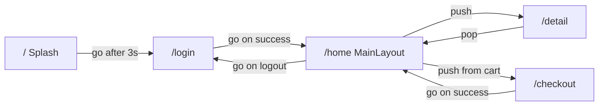
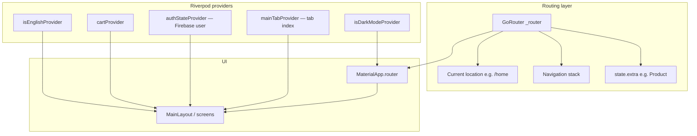

# Routing and Core Architecture

This document explains how navigation works in the **K-24 Pharmacy** Flutter app (`k24_mvp`). It focuses on `main.dart`, `go_router`, and how those pieces fit into the wider app structure.

---

## Table of Contents

1. [Big Picture: How the App Boots](#big-picture-how-the-app-boots)
2. [What: What Is Declarative Routing?](#what-what-is-declarative-routing)
3. [How: How go_router Works in Our App](#how-how-go_router-works-in-our-app)
4. [Step-by-Step: What Happens When a User Opens the App](#step-by-step-what-happens-when-a-user-opens-the-app)
5. [Why & Why Not: Why go_router?](#why--why-not-why-go_router)
6. [When & Where: Choosing Declarative vs Imperative Routing](#when--where-choosing-declarative-vs-imperative-routing)
7. [Examples: Hotel Analogy for the Router Tree](#examples-hotel-analogy-for-the-router-tree)
8. [Our Route Map (Quick Reference)](#our-route-map-quick-reference)
9. [Two Layers of Navigation](#two-layers-of-navigation)
10. [Where State Lives](#where-state-lives)
11. [Tips for Developers Working on This Project](#tips-for-developers-working-on-this-project)

---

## Big Picture: How the App Boots

Before any screen appears, `main.dart` sets up the foundation:

```dart
Future<void> main() async {
  WidgetsFlutterBinding.ensureInitialized();
  await Firebase.initializeApp(options: DefaultFirebaseOptions.currentPlatform);
  runApp(const ProviderScope(child: K24App()));
}
```

| Piece | Role |
|-------|------|
| `WidgetsFlutterBinding.ensureInitialized()` | Lets Flutter finish engine setup before async work (Firebase). |
| `Firebase.initializeApp(...)` | Connects the app to Firebase (Auth, Firestore). |
| `ProviderScope` | Wraps the app in **Riverpod** so screens can read/write shared state (cart, theme, tabs, etc.). |
| `K24App` | The root widget. Builds `MaterialApp.router` and hands routing to `go_router`. |

`K24App` is a `ConsumerWidget`, so it can watch Riverpod providers (for example, dark mode) and rebuild the theme when they change:

```dart
return MaterialApp.router(
  title: 'K-24 Pharmacy',
  theme: _buildLightTheme(),
  darkTheme: _buildDarkTheme(),
  themeMode: isDarkMode ? ThemeMode.dark : ThemeMode.light,
  routerConfig: _router,  // <-- go_router takes over navigation here
);
```

**Key idea:** `MaterialApp.router` does **not** use a `home:` property. Instead, it uses `routerConfig`, which tells Flutter: *"Don't pick the first screen yourself — ask the router what to show based on the current URL/path."*

---

## What: What Is Declarative Routing?

There are two ways to think about navigation in Flutter:

### Imperative routing (commands)

You **tell** the app what to do, step by step:

```dart
Navigator.push(context, MaterialPageRoute(builder: (_) => DetailScreen()));
Navigator.pop(context);
```

This is like giving verbal directions: *"Go to the next room, then come back."* The app executes commands, but there is no single source of truth that says *"the user is currently at `/detail`."*

### Declarative routing (state → UI)

You **declare** a map from locations (paths/URLs) to screens, then you **update the location**. The router figures out which widgets to build:

```dart
// Declared once in main.dart:
GoRoute(path: '/login', builder: (_, __) => const LoginScreen()),

// Later, anywhere in the app:
context.go('/login');
```

This is like a **floor plan with labeled rooms**: you change the label ("we are now on floor `/home`"), and the building (router) shows the right room.

| Declarative | Imperative |
|-------------|------------|
| "Show screen for path `/login`" | "Push LoginScreen onto the stack" |
| Location is explicit (`/home`, `/detail`) | Stack history is implicit |
| Great for deep links, web URLs, auth redirects | Great for simple, local transitions |
| Router rebuilds the widget tree from the path | Navigator mutates a stack of routes |

**In this project:** All top-level screens are declared in one `GoRouter` in `main.dart`. Screens call `context.go`, `context.push`, or `context.pop` to change where the user is — they do not call `Navigator.push` directly.

---

## How: How go_router Works in Our App

### The router definition

In `lib/main.dart`, a single global `GoRouter` instance defines every top-level route:

```dart
final GoRouter _router = GoRouter(
  initialLocation: '/',
  routes: [
    GoRoute(path: '/', builder: (_, __) => const SplashScreen()),
    GoRoute(path: '/login', builder: (_, __) => const LoginScreen()),
    GoRoute(path: '/register', builder: (_, __) => const RegisterScreen()),
    GoRoute(path: '/forgot_password', builder: (_, __) => const ForgotPasswordScreen()),
    GoRoute(path: '/home', builder: (_, __) => const MainLayout()),
    GoRoute(
      path: '/detail',
      builder: (context, state) {
        final product = state.extra as Product?;
        if (product == null) {
          return const Scaffold(body: Center(child: Text('Product not found')));
        }
        return DetailScreen(product: product);
      },
    ),
    GoRoute(path: '/checkout', builder: (_, __) => const CheckoutScreen()),
    GoRoute(path: '/profile_detail', builder: (_, __) => const ProfileDetailScreen()),
    GoRoute(path: '/about', builder: (_, __) => const AboutScreen()),
    GoRoute(path: '/favorites', builder: (_, __) => const FavoriteScreen()),
  ],
);
```

### What go_router does under the hood (simplified)

1. **Stores the current location** — e.g. `/`, `/login`, `/home`, `/detail`.
2. **Matches the location to a `GoRoute`** — walks the `routes` list (our app uses a flat list; larger apps often nest routes).
3. **Calls the route's `builder`** — returns the `Widget` for that screen.
4. **Feeds that into `MaterialApp.router`** — Flutter's Router API (Navigator 2.0) displays the widget and maintains back-stack behavior.
5. **Listens for location changes** — when you call `context.go('/home')`, go_router updates its location and triggers a rebuild.

You can picture it as a pipeline:

```
User action (tap, timer, login success)
        ↓
context.go / context.push / context.pop
        ↓
GoRouter updates "current location" + stack
        ↓
Matching GoRoute.builder runs
        ↓
MaterialApp.router rebuilds → new screen on screen
```

### `go` vs `push` vs `pop` in our codebase

| Method | Effect | Used when |
|--------|--------|-----------|
| `context.go('/path')` | **Replaces** the current route (and often clears stack). User typically cannot "back" to the previous top-level screen. | Splash → Login, Login → Home, Logout → Login, Checkout success → Home |
| `context.push('/path')` | **Stacks** a new route on top. Back button / `pop` returns to the previous screen. | Product detail, checkout, register, forgot password, profile sub-pages |
| `context.pop()` | Removes the top route from the stack. | AppBar back buttons, cancel flows |

**Real examples from this project:**

```dart
// splash_screen.dart — after 3 seconds, replace splash with login
context.go('/login');

// login_screen.dart — after successful login, replace login with home
context.go('/home');

// home_screen.dart — open product detail on top of home
context.push('/detail', extra: product);

// detail_screen.dart — go back to home (still on /home underneath)
context.pop();
```

### Passing data: `state.extra`

Some routes need more than a path. Our `/detail` route expects a `Product` object:

```dart
context.push('/detail', extra: product);
```

The builder reads it from `state.extra`. If someone navigates to `/detail` without data (e.g. a bad deep link), the builder shows a fallback *"Product not found"* screen instead of crashing.

---

## Step-by-Step: What Happens When a User Opens the App

Here is a full trace from cold start through a typical shopping flow.

### Phase 1 — App launch

1. **OS starts the app** → `main()` runs.
2. **Flutter binding initializes** → `WidgetsFlutterBinding.ensureInitialized()`.
3. **Firebase connects** → Auth and Firestore become available.
4. **`runApp(ProviderScope(child: K24App()))`** → Riverpod and the widget tree start.
5. **`K24App.build`** → reads theme from `isDarkModeProvider`, builds `MaterialApp.router(routerConfig: _router)`.
6. **go_router reads `initialLocation: '/'`** → current location is `/`.
7. **Router matches `GoRoute(path: '/')`** → builder returns `SplashScreen`.
8. **User sees the splash screen** — logo and tagline for 3 seconds.

### Phase 2 — Splash → Login

9. **`SplashScreen.initState`** schedules a 3-second timer.
10. **Timer fires** → `context.go('/login')`.
11. **go_router sets location to `/login`** — splash is replaced (not stacked).
12. **`LoginScreen` appears** — user enters email/password.

### Phase 3 — Login → Home (main shell)

13. **User taps Login** → `_onLogin()` calls Firebase via `authProvider`.
14. **On success** → `context.go('/home')`.
15. **go_router shows `MainLayout`** at `/home`.
16. **`MainLayout` is not a single screen** — it hosts a **bottom navigation bar** with four tabs (Home, Cart, Orders, Profile) using an `IndexedStack`.
17. **Tab index comes from `mainTabProvider`** (Riverpod), default `0` → user sees `HomeScreen`.

### Phase 4 — Browse and open product detail

18. **User taps a product card** on `HomeScreen` → `context.push('/detail', extra: product)`.
19. **Stack is now:** `/home` (underneath) → `/detail` (on top).
20. **`DetailScreen` receives the `Product`** from `state.extra`.
21. **User taps back** → `context.pop()` → returns to `/home` with the same tab state preserved.

### Phase 5 — Cart and checkout

22. **User switches to Cart tab** → `mainTabProvider` updates to index `1` (no URL change; still `/home`).
23. **User taps checkout** → `context.push('/checkout')`.
24. **Stack:** `/home` → `/checkout`.
25. **After order completes** → `context.go('/home')` — replaces stack back to home (user does not land back on checkout when pressing system back).

### Phase 6 — Profile sub-routes and logout

26. **Profile tab** → user taps "Profile Detail" → `context.push('/profile_detail')`.
27. **User taps About / Favorites** → `context.push('/about')` or `context.push('/favorites')`.
28. **User logs out** → `context.go('/login')` — clears authenticated shell and returns to login.

### Diagram: Typical session flow



---

## Why & Why Not: Why go_router?

### Why we use go_router

| Reason | How it helps this project |
|--------|---------------------------|
| **Single route table** | All paths live in `main.dart` — easy to see the whole app map at a glance. |
| **URL-based paths** | Paths like `/login`, `/home`, `/detail` are readable and consistent. Important for **Flutter Web** (browser address bar) and future **deep linking**. |
| **Built on Navigator 2.0** | Gets declarative benefits without hand-writing `RouterDelegate`, `RouteInformationParser`, etc. |
| **Simple API** | `context.go`, `context.push`, `context.pop` are ergonomic and work from any descendant of `MaterialApp.router`. |
| **Ecosystem fit** | Pairs naturally with `MaterialApp.router`, which is the modern Flutter entry point for routed apps. |

### Why not `Navigator.push()` (imperative / Navigator 1.0)?

| Navigator.push pros | Navigator.push cons for this app |
|---------------------|----------------------------------|
| Very simple for one-off pushes | No central list of routes — hard to audit "what screens exist?" |
| Minimal setup | Web URLs and browser back/forward do not map cleanly to screens |
| Familiar to beginners | Auth flows (login → home → logout) require manual stack management |
| | Passing data is ad hoc (`RouteSettings.arguments`) with less structure than `state.extra` + typed builders |
| | Testing and deep links need custom glue code |

**Verdict:** `Navigator.push` is fine for tiny apps or modal dialogs inside a single screen. For an app with auth, a main shell, and multiple sub-flows (checkout, profile, favorites), a declarative router scales better.

### Why not raw Navigator 2.0 (without go_router)?

Navigator 2.0 is Flutter's **low-level** declarative API. You implement:

- `RouteInformationParser` — parse URL → app state
- `RouterDelegate` — app state → widget stack
- `BackButtonDispatcher` — sync Android back button

| Raw Navigator 2.0 pros | Raw Navigator 2.0 cons |
|------------------------|------------------------|
| Maximum control | Lots of boilerplate |
| No third-party dependency | Easy to get wrong (sync bugs, back stack issues) |
| | Every team reinvents path matching, redirects, and nested navigation |

**go_router is essentially a opinionated, maintained layer on top of Navigator 2.0.** We get declarative routing without maintaining ~200+ lines of delegate/parser code ourselves.

### Comparison summary

| Feature | Navigator.push | Navigator 2.0 (manual) | go_router (our choice) |
|---------|----------------|------------------------|-------------------------|
| Learning curve | Low | High | Medium |
| Central route config | No | You build it | Yes (`routes: [...]`) |
| Web / deep link friendly | Poor | Yes (if implemented) | Yes |
| Back stack control | Manual | Manual | `go` / `push` / `pop` |
| Boilerplate | Low | Very high | Low |
| Auth redirects | Manual | Custom | Supported (`redirect:` — not used yet in our app) |

---

## When & Where: Choosing Declarative vs Imperative Routing

### When to prefer **declarative** (go_router, like our app)

- Multiple top-level screens (auth, home, settings, checkout).
- You want **one source of truth** for "where is the user?"
- You target **web**, **deep links**, or **shareable URLs**.
- You need **global redirects** (e.g. "if not logged in, send to `/login`" — a natural future enhancement).
- Several developers need to **discover routes** without grep-ing for `Navigator.push`.

### When **imperative** (`Navigator.push`) is still reasonable

- **Dialogs, bottom sheets, full-screen modals** inside one route.
- Short-lived overlays that should not appear in the URL.
- Very small prototypes with 2–3 screens and no web target.

### Where is route state kept?

| State | Where it lives | What it represents |
|-------|----------------|-------------------|
| **Current path / URL** | Inside `GoRouter` (owned by `_router` in `main.dart`) | e.g. `/home`, `/detail` |
| **Navigation stack** | go_router's internal stack (Navigator 2.0) | e.g. `/home` under `/detail` after a `push` |
| **Route parameters / extras** | `GoRouterState` per navigation (`state.extra`, `state.pathParameters`, `state.queryParameters`) | e.g. `Product` passed to `/detail` |
| **Bottom tab index** | `mainTabProvider` (Riverpod `StateProvider<int>`) | Which tab is visible inside `/home` — **not** in the URL |
| **Auth session** | Firebase Auth + `authStateProvider` | Whether a user is signed in — **not** wired into go_router redirects yet |
| **Cart, favorites, theme, locale** | Other Riverpod providers | Business/UI state separate from routing |

**Important distinction in our app:** Changing tabs (Home → Cart) does **not** change the go_router path — you stay on `/home`. Only `mainTabProvider` changes. That is intentional: the bottom bar is **local UI state** inside the home shell, not a separate URL (though you could model it as `/home/cart` with nested routes if you wanted shareable tab URLs).

---

## Examples: Hotel Analogy for the Router Tree

Imagine the app as a **hotel**:

| App concept | Hotel analogy |
|-------------|---------------|
| `GoRouter` | The front desk system that knows every room number and which key to issue |
| `GoRoute` | A labeled room (e.g. `/login` = Lobby Check-in, `/home` = Main Guest Floor) |
| `initialLocation: '/'` | Every guest starts at the **Lobby Entrance** (Splash) |
| `context.go('/login')` | Staff escorts you **directly** to Check-in — you don't keep a trail of previous rooms on your key card |
| `context.push('/detail')` | You **visit an additional room** (Product Suite) while your Main Floor key still works underneath; `pop` is walking back |
| `state.extra` | A **folder of papers** hand-delivered to the Product Suite — not written on the room number sign, but required for the visit |
| `MainLayout` + bottom tabs | One floor (`/home`) with **four wings** (Home, Cart, Orders, Profile). Switching wings is an elevator panel (`mainTabProvider`), not a new hotel building |
| `MaterialApp.router` | The hotel's master power system — when the front desk changes your room assignment, the lights and doors update everywhere automatically |

### Router tree (our flat structure)

```
Hotel K-24 (GoRouter)
│
├── /              → Splash Lobby (temporary, 3 sec)
├── /login         → Check-in Desk
├── /register      → New Guest Registration (stacked visit from login)
├── /forgot_password → Password Help Desk (stacked visit from login)
│
├── /home          → Main Guest Floor (MainLayout)
│     ├── [tab 0]  → Home Wing      (IndexedStack — not separate URLs)
│     ├── [tab 1]  → Cart Wing
│     ├── [tab 2]  → Orders Wing
│     └── [tab 3]  → Profile Wing
│
├── /detail        → Product Suite (needs `extra: product`)
├── /checkout      → Payment Office
├── /profile_detail → Guest Profile Room
├── /about         → Hotel Info Lounge
└── /favorites     → Saved Items Closet
```

Unlike a deep hotel with floors-inside-floors, our `routes` list is **flat** — every room is a top-level path. The exception is **logical** nesting: `/home` contains tab content that is not expressed as child `GoRoute`s.

---

## Our Route Map (Quick Reference)

| Path | Screen | Typical navigation |
|------|--------|-------------------|
| `/` | `SplashScreen` | App start; auto `go` → `/login` |
| `/login` | `LoginScreen` | `go` → `/home` on success; `push` → register / forgot password |
| `/register` | `RegisterScreen` | `pop` back to login |
| `/forgot_password` | `ForgotPasswordScreen` | `pop` back to login |
| `/home` | `MainLayout` (tabs) | Hub after login; tabs via `mainTabProvider` |
| `/detail` | `DetailScreen` | `push` with `extra: product`; `pop` to return |
| `/checkout` | `CheckoutScreen` | `push` from cart; `go` → `/home` after order |
| `/profile_detail` | `ProfileDetailScreen` | `push` from profile; `pop` to return |
| `/about` | `AboutScreen` | `push` from profile; `pop` to return |
| `/favorites` | `FavoriteScreen` | `push` from profile; `go` → `/home` if empty CTA |

---

## Two Layers of Navigation

This app uses **two cooperating systems**. New developers often confuse them:

### Layer 1 — go_router (between top-level screens)

- Controls **which major screen** is visible.
- Driven by **path** (`/home`, `/detail`, …).
- Configured in **`main.dart`**.

### Layer 2 — Tab navigation (inside `/home`)

- Controlled by **`MainLayout`** + **`mainTabProvider`**.
- Uses **`IndexedStack`** so all four tab screens stay alive in memory (state preserved when switching tabs).
- Changing tabs does **not** call `context.go`.

```dart
// main_layout.dart
body: IndexedStack(
  index: currentIndex,
  children: _screens,  // Home, Cart, Orders, Profile
),
bottomNavigationBar: BottomNavigationBar(
  onTap: (index) => ref.read(mainTabProvider.notifier).state = index,
  ...
),
```

**Rule of thumb:** If the screen has its own entry in `_router.routes`, use go_router. If it is one of the four bottom tabs, use `mainTabProvider`.

---

## Where State Lives



- **Route state** answers: *"Which screen widget should be built?"*
- **Provider state** answers: *"What data and UI preferences should that screen show?"*

They are intentionally separate. For example, after `context.go('/home')`, the cart tab might still show old items because `cartProvider` persists across navigations.

---

## Tips for Developers Working on This Project

1. **Adding a new top-level screen** — Add a `GoRoute` in `main.dart`, create the screen widget, navigate with `context.push` or `context.go` as appropriate.

2. **Choose `go` vs `push` deliberately**
   - Use **`go`** when the user should not return to the previous screen (auth transitions, post-checkout).
   - Use **`push`** when you want a back button (detail, settings sub-pages).

3. **Passing complex objects** — Prefer `extra` (as with `Product`) or path/query parameters for simple IDs. For very large data, consider passing an ID and loading from a provider.

4. **Auth guard (future improvement)** — Today, nothing in `GoRouter` prevents visiting `/home` without logging in. A `redirect` callback on `GoRouter` could watch `authStateProvider` and send unauthenticated users to `/login`. That would centralize auth routing logic.

5. **Nested routes (future improvement)** — Tab URLs like `/home/cart` would use child `GoRoute`s under `/home`. Not required for MVP, but useful for web bookmarking.

6. **Do not mix APIs carelessly** — Avoid raw `Navigator.push` for screens that are already in the `GoRouter` table; it can desync the URL stack from what go_router believes the location is.

---

## Summary

- **`main.dart`** bootstraps Firebase, Riverpod, theming, and connects **`MaterialApp.router`** to a single **`GoRouter`** instance.
- **Declarative routing** means: define paths → update location → router builds the right screen.
- **go_router** wraps Navigator 2.0 and gives us `go` / `push` / `pop` plus a clear route table.
- **On app open:** `/` (splash) → `/login` → `/home` (tabbed shell) → optional `push` flows for detail, checkout, and profile pages.
- **Route state** lives in go_router; **tab and business state** live in Riverpod providers — two layers, one cohesive app.

Understanding that split is the key to navigating and extending the K-24 codebase confidently.
