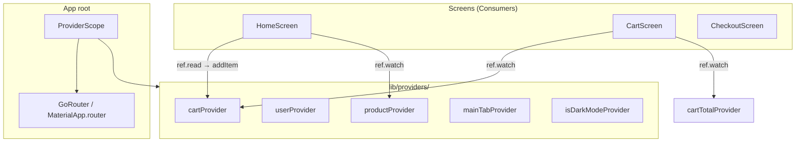
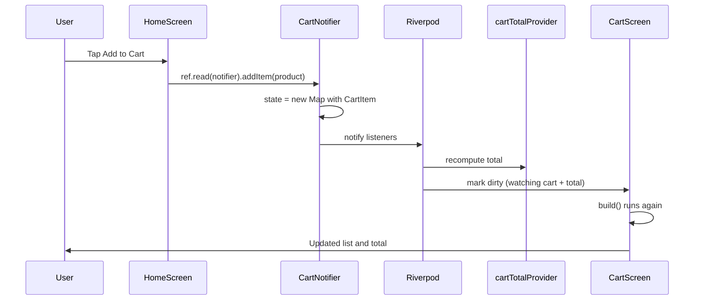
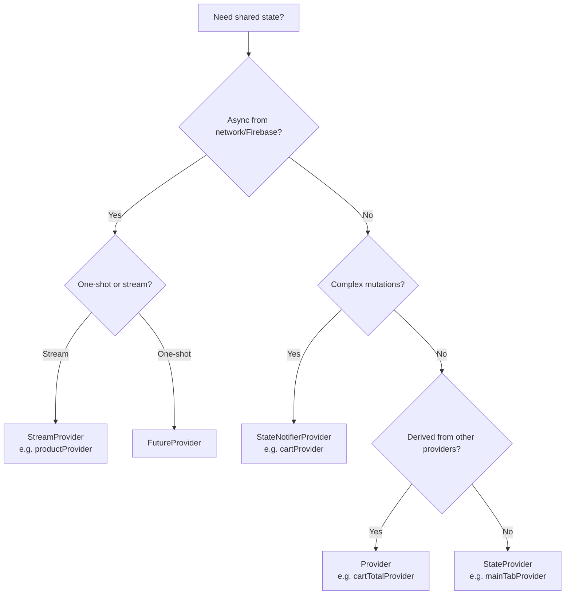
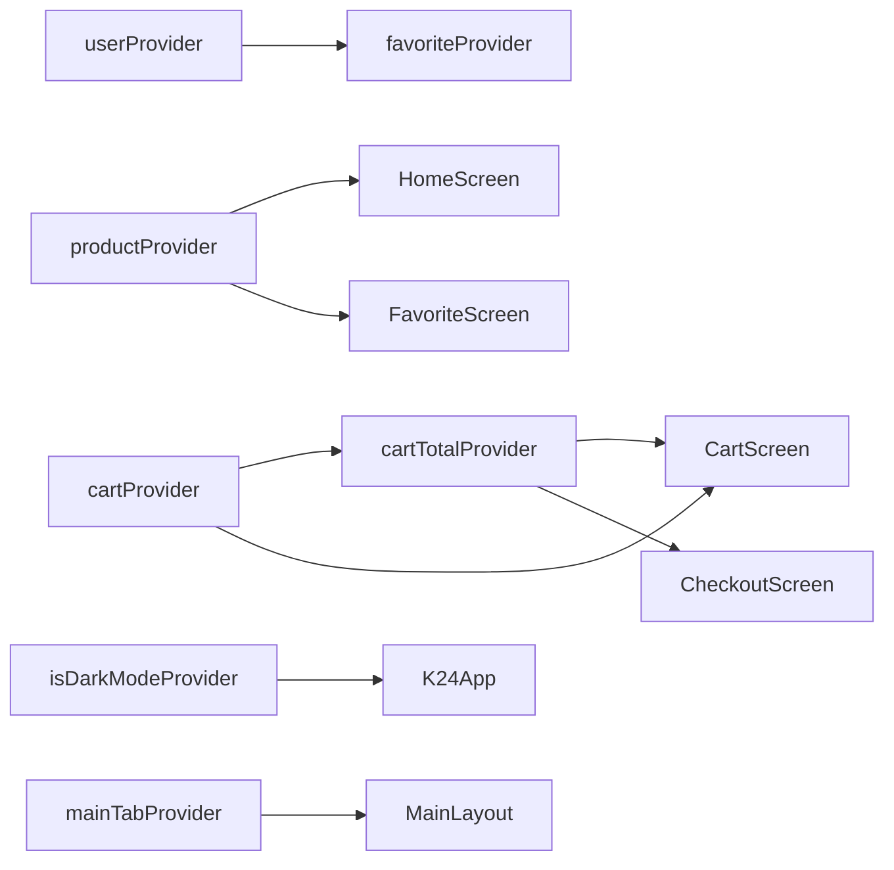

# State Management with Riverpod

This document explains how shared application state works in the **K-24 Pharmacy** Flutter app (`k24_mvp`). It focuses on the `lib/providers/` folder, `flutter_riverpod`, and how data flows from user actions to UI updates.

For navigation, see [1_Routing_and_Architecture.md](./1_Routing_and_Architecture.md).

---

## Table of Contents

1. [Big Picture: State in Our App](#big-picture-state-in-our-app)
2. [What: What Is State Management? What Is flutter_riverpod?](#what-what-is-state-management-what-is-flutter_riverpod)
3. [How: ref.watch vs ref.read](#how-refwatch-vs-refread)
4. [Lifecycle Trace: Add to Cart → UI Update](#lifecycle-trace-add-to-cart--ui-update)
5. [Our Providers (Inventory)](#our-providers-inventory)
6. [Why & Why Not: Why Riverpod?](#why--why-not-why-riverpod)
7. [When & Where: Which Provider Type? Where Does State Live?](#when--where-which-provider-type-where-does-state-live)
8. [Examples: Restaurant Kitchen Analogy](#examples-restaurant-kitchen-analogy)
9. [Provider Dependencies in This Project](#provider-dependencies-in-this-project)
10. [Tips for Developers Working on This Project](#tips-for-developers-working-on-this-project)

---

## Big Picture: State in Our App

Flutter widgets are **immutable** and rebuilt frequently. Anything that must survive a rebuild — cart contents, logged-in user, dark mode, selected tab — needs to live **outside** individual widgets.

In `k24_mvp`, that shared memory is managed by **Riverpod**:

```dart
// main.dart
runApp(
  const ProviderScope(
    child: K24App(),
  ),
);
```

`ProviderScope` creates a **container** at the root of the widget tree. Every provider in `lib/providers/` registers state inside that container. Screens access it through a `WidgetRef` (`ref`) when they extend `ConsumerWidget` or `ConsumerStatefulWidget`.



**Separation of concerns in this project:**

| Layer | Responsibility | Example |
|-------|----------------|---------|
| **go_router** | *Where* is the user? (path/stack) | `/home`, `/checkout` |
| **Riverpod** | *What data* does the app hold? | Cart map, user profile, product list |
| **Widget `setState`** | *Local UI-only* state inside one screen | Search text, password visibility toggle |

---

## What: What Is State Management? What Is flutter_riverpod?

### What is state?

**State** is any data that can change over time and affects what the user sees or what the app does:

- Cart items and quantities
- Whether dark mode is on
- The current Firebase user profile
- The list of products from Firestore
- Which bottom tab is selected

Without state management, you would pass this data manually through constructor parameters (`Cart cart, User user, ...`) across dozens of screens — brittle and hard to maintain.

### What is state management?

**State management** is the discipline of:

1. **Storing** shared data in a predictable place
2. **Updating** it through clear APIs (not random global variables)
3. **Notifying** widgets when data changes so they rebuild
4. **Disposing** resources (streams, listeners) when no longer needed

### What is flutter_riverpod?

**Riverpod** (specifically `flutter_riverpod: ^2.6.1` in our `pubspec.yaml`) is a compile-safe, testable state management library for Flutter. It improves on the older `provider` package with:

- **Providers as global declarations** — e.g. `final cartProvider = ...` in its own file
- **`ref` for dependency wiring** — providers can watch other providers
- **No `BuildContext` required** to read state in business logic
- **Multiple provider "shapes"** for different kinds of state (sync, async, streams)

Core vocabulary:

| Term | Meaning in our app |
|------|-------------------|
| **Provider** | A recipe + storage slot for one piece of state |
| **ProviderScope** | Root container holding all provider instances |
| **ConsumerWidget** | A widget that receives `WidgetRef ref` to watch/read providers |
| **Notifier / StateNotifier** | Class with methods that mutate state (`addItem`, `login`, …) |
| **ref.watch** | Subscribe — rebuild when this provider changes |
| **ref.read** | One-shot access — call actions, no subscription |

---

## How: ref.watch vs ref.read

Both methods access the same underlying container. The difference is **subscription and rebuild behavior**.

### ref.watch — "Stay tuned"

```dart
// cart_screen.dart
final cartItems = ref.watch(cartProvider).values.toList();
final total = ref.watch(cartTotalProvider);
```

**What happens under the hood:**

1. During `build`, Riverpod registers this widget as a **listener** of `cartProvider` (and `cartTotalProvider`).
2. Riverpod returns the **current value** of each provider.
3. When `cartProvider`'s state changes, Riverpod marks this widget **dirty**.
4. Flutter schedules a **rebuild** of `CartScreen`.
5. On rebuild, `ref.watch` runs again and returns the new cart data.

**Rule:** Use `watch` in `build` (or in providers that derive other providers) whenever the UI should **automatically reflect** changes.

### ref.read — "Just do it once"

```dart
// home_screen.dart — inside a button handler, not in build()
void _onAddToCart(Product product) {
  ref.read(cartProvider.notifier).addItem(product);
}
```

**What happens under the hood:**

1. Riverpod looks up `cartProvider` in the container **right now**.
2. It returns the notifier **without** subscribing the widget to future changes.
3. `addItem` mutates internal state.
4. Only widgets that used `ref.watch(cartProvider)` get rebuilt — not necessarily the widget that called `read`.

**Rule:** Use `read` in callbacks (`onPressed`, `onTap`, `initState` one-offs, `Future` completion handlers) to **trigger actions** without creating extra rebuild subscriptions.

### Common mistake

```dart
@override
Widget build(BuildContext context, WidgetRef ref) {
  // BAD: read in build — UI won't update when cart changes
  final cart = ref.read(cartProvider);
}
```

Always **`watch` in `build`**, **`read` in event handlers**.

### ref.listen (used in our codebase)

`FavoriteNotifier` uses `ref.listen` to react when another provider changes:

```dart
_ref.listen(userProvider, (previous, next) {
  state = List<String>.from(next.favorites);
});
```

`listen` is for **side effects** (sync favorites when user profile loads), not for building UI directly.

### ConsumerWidget vs ConsumerStatefulWidget

| Type | When we use it |
|------|----------------|
| `ConsumerWidget` | Stateless screen; only needs `ref` in `build` (`CartScreen`, `DetailScreen`) |
| `ConsumerStatefulWidget` | Needs `State` for controllers, timers, or local fields (`HomeScreen`, `LoginScreen`) |

Both give you `ref` — the choice is about **local widget state**, not Riverpod vs non-Riverpod.

---

## Lifecycle Trace: Add to Cart → UI Update

This traces the real path in our codebase when a user taps **Add to Cart** on the home screen.

### Setup (before the tap)

1. **`ProviderScope`** at app root created a **ProviderContainer**.
2. **`cartProvider`** was first accessed (lazily) — Riverpod instantiated one **`CartNotifier`** with initial state `{}` (empty map).
3. **`CartScreen`** is inside `MainLayout`'s `IndexedStack` at tab index 1. Even when not visible, it may already have run `build` once.
4. **`CartScreen.build`** called `ref.watch(cartProvider)` — CartScreen is now a **registered listener**.

### Step 1 — User taps Add to Cart

On `HomeScreen`, the product card's add button calls `_onAddToCart(product)`:

```dart
void _onAddToCart(Product product) {
  ref.read(cartProvider.notifier).addItem(product);
  // ... SnackBar ...
}
```

- `ref.read` — no new subscription from this call
- `.notifier` — returns the `CartNotifier` instance (singleton per container)

### Step 2 — CartNotifier mutates state

Inside `cart_provider.dart`:

```dart
void addItem(Product product) {
  final existing = state[product.id];
  if (existing != null) {
    state = {
      ...state,
      product.id: existing.copyWith(quantity: existing.quantity + 1),
    };
  } else {
    state = {
      ...state,
      product.id: CartItem(product: product, quantity: 1),
    };
  }
}
```

Important details:

- `state` is a `Map<String, CartItem>` keyed by product ID
- Assignment `state = { ... }` creates a **new map** (immutability pattern) so Riverpod detects a change
- `StateNotifier` compares old vs new state and notifies listeners

### Step 3 — Riverpod propagates the change

1. `cartProvider` listeners are notified
2. **`cartTotalProvider`** also rebuilds — it is a derived `Provider` that `ref.watch(cartProvider)` internally:

```dart
final cartTotalProvider = Provider<int>((ref) {
  final cart = ref.watch(cartProvider);
  return cart.values.fold(0, (sum, item) => sum + item.lineTotal);
});
```

3. Any widget that `watch`es `cartProvider` or `cartTotalProvider` is marked dirty

### Step 4 — UI rebuilds

| Widget | Watches | What updates |
|--------|---------|--------------|
| `CartScreen` | `cartProvider`, `cartTotalProvider` | Item list, quantity, footer total |
| `CheckoutScreen` (if open) | `cartTotalProvider` | Subtotal display |
| `HomeScreen` | Does **not** watch cart | No cart-driven rebuild (only SnackBar via `ScaffoldMessenger`) |

4. Flutter runs `CartScreen.build` again
5. `ref.watch(cartProvider)` returns the updated map
6. `ListView` shows the new item (or increased quantity)
7. `ref.watch(cartTotalProvider)` returns the new Rupiah total

### Step 5 — User switches to Cart tab (optional)

Tab change uses a **different** provider:

```dart
ref.read(mainTabProvider.notifier).state = 1;
```

`mainTabProvider` is a `StateProvider<int>`. Cart data was already in memory — switching tabs does not re-fetch cart; `IndexedStack` may simply reveal the already-updated `CartScreen`.

### Sequence diagram



---

## Our Providers (Inventory)

All providers live in `lib/providers/`:

| File | Provider | Type | State shape | Purpose |
|------|----------|------|-------------|---------|
| `cart_provider.dart` | `cartProvider` | `StateNotifierProvider` | `Map<String, CartItem>` | In-memory shopping cart |
| `cart_provider.dart` | `cartTotalProvider` | `Provider` (derived) | `int` | Computed sum from cart |
| `auth_provider.dart` | `authProvider` | `StateNotifierProvider` | `void` | Login, register, logout actions |
| `auth_provider.dart` | `authStateProvider` | `StreamProvider` | `AsyncValue<User?>` | Firebase auth stream (defined, not yet used in screens) |
| `user_provider.dart` | `userProvider` | `StateNotifierProvider` | `UserModel` | Profile loaded from Firestore |
| `favorite_provider.dart` | `favoriteProvider` | `StateNotifierProvider` | `List<String>` | Favorite product IDs, synced to Firestore |
| `product_provider.dart` | `productProvider` | `StreamProvider` | `AsyncValue<List<Product>>` | Live product catalog from Firestore |
| `order_provider.dart` | `orderProvider` | `StateNotifierProvider` | `List<OrderModel>` | User orders (Firestore snapshot listener) |
| `theme_provider.dart` | `isDarkModeProvider` | `StateProvider` | `bool` | Light/dark theme toggle |
| `locale_provider.dart` | `isEnglishProvider` | `StateProvider` | `bool` | ID/EN UI strings (not full `Locale` yet) |
| `main_tab_provider.dart` | `mainTabProvider` | `StateProvider` | `int` | Bottom nav index 0–3 |

### Persistence model

| Data | Survives app restart? | Stored where |
|------|----------------------|--------------|
| Cart | **No** (in-memory only) | `CartNotifier.state` in RAM |
| Theme / language / tab | **No** | `StateProvider` in RAM |
| User profile, favorites, orders, products | **Yes** (via Firebase) | Firestore + cached in notifiers while app runs |

---

## Why & Why Not: Why Riverpod?

### Why we use Riverpod

| Reason | How it helps K-24 |
|--------|-------------------|
| **Centralized providers** | Cart, auth, user, orders each have one obvious file |
| **Composable dependencies** | `cartTotalProvider` derives from `cartProvider`; `favoriteProvider` listens to `userProvider` |
| **Works with async & streams** | `productProvider` wraps Firestore `snapshots()` as `AsyncValue` |
| **Testability** | Notifiers accept injected `FirebaseAuth` / `FirebaseFirestore` (see constructors) |
| **No context needed for logic** | `CartNotifier.addItem` does not need `BuildContext` |
| **Pairs with our architecture** | `ProviderScope` wraps the same tree as `go_router` — routing and state stay separate |

### Comparison with alternatives

#### setState() only

| Similarity | Difference |
|------------|------------|
| Both trigger UI rebuilds | `setState` only updates **one** `State` object |
| | Cart on `HomeScreen` would not reach `CartScreen` without passing callbacks/objects up and down |
| | State is lost when widget is disposed unless manually lifted |

**Verdict:** Fine for local UI (our `HomeScreen` uses `setState` for search field and category filter). Wrong tool for **cross-screen** cart, auth, and Firestore data.

#### Provider (package: `provider`)

| Similarity | Difference |
|------------|------------|
| InheritedWidget-based sharing | Riverpod removes reliance on `BuildContext` for reads |
| `ChangeNotifier` / `Consumer` patterns | Riverpod has compile-time provider references (`ref.watch(cartProvider)`) |
| Same author ecosystem (Remi Rousselet) | Riverpod supports `family`, `autoDispose`, stricter overrides for tests |

**Verdict:** Provider is simpler for tiny apps. Riverpod is the **successor** — better for apps with many providers and Firebase streams like ours.

#### Bloc (flutter_bloc)

| Similarity | Difference |
|------------|------------|
| Separates UI from business logic | Bloc uses **Events → Bloc → States** ceremony |
| Immutable state | More boilerplate: `CartAddItemEvent`, `CartState`, `CartBloc` |
| Testable | Riverpod's `StateNotifier` is lighter for straightforward CRUD |

**Verdict:** Bloc shines in large teams with strict event tracing. Our cart/user flows are direct method calls (`addItem`, `login`) — `StateNotifier` is enough.

#### GetX

| Similarity | Difference |
|------------|------------|
| Global access to state | GetX bundles routing, DI, and state (`Get.put`, `Obx`) |
| Reactive UI | Less idiomatic in standard Flutter; magic globals |
| | Our project already standardized on **go_router + Riverpod** |

**Verdict:** GetX is fast to prototype but mixes concerns. We already chose declarative routing and explicit providers.

### Summary table

| Solution | Learning curve | Cross-screen state | Async/streams | Fits this project |
|----------|----------------|-------------------|---------------|-------------------|
| `setState` | Lowest | Poor | Manual | Local UI only |
| Provider | Low | Good | Good | Would work; Riverpod is newer |
| **Riverpod** | Medium | Excellent | Excellent | **Chosen** |
| Bloc | Higher | Excellent | Excellent | Overkill for current size |
| GetX | Low | Excellent | Good | Conflicts with go_router style |

---

## When & Where: Which Provider Type? Where Does State Live?

### When to use each provider type (with our examples)

#### StateProvider — simple mutable value

```dart
final mainTabProvider = StateProvider<int>((ref) => 0);
final isDarkModeProvider = StateProvider<bool>((ref) => false);
```

**Use when:**

- Single primitive or small immutable value
- Updates are trivial: `ref.read(mainTabProvider.notifier).state = 2`
- No complex logic or async

**Our uses:** tab index, dark mode, language flag.

#### StateNotifierProvider — structured state + methods

```dart
final cartProvider =
    StateNotifierProvider<CartNotifier, Map<String, CartItem>>((ref) {
  return CartNotifier();
});
```

**Use when:**

- State is an object, list, or map with **multiple operations**
- You want a dedicated class (`CartNotifier`, `UserNotifier`)
- Sync logic, possibly calling Firebase inside methods

**Our uses:** cart, auth actions, user profile, favorites, orders.

#### StreamProvider / FutureProvider — async data

```dart
final productProvider = StreamProvider<List<Product>>((ref) {
  return _productsStream(FirebaseFirestore.instance);
});

final authStateProvider = StreamProvider<User?>((ref) {
  return FirebaseAuth.instance.authStateChanges();
});
```

**Use when:**

- Data comes from **Firestore snapshots**, **HTTP**, or **Firebase Auth streams**
- UI should handle loading/error via `AsyncValue.when(...)`

**Our uses:** product catalog stream; auth state stream (ready for global auth-aware UI).

#### Provider (plain) — computed / derived state

```dart
final cartTotalProvider = Provider<int>((ref) {
  final cart = ref.watch(cartProvider);
  return cart.values.fold(0, (sum, item) => sum + item.lineTotal);
});
```

**Use when:**

- Value is **derived** from other providers
- No external mutation API needed
- Automatic recalculation when dependencies change

**Our uses:** cart total from cart map.

### Decision flowchart



### Where does state physically live?

All Riverpod provider state for this app lives in **device RAM** while the app process is running:

```
┌─────────────────────────────────────────────────────────┐
│  Flutter app process (Android / iOS / Web tab)          │
│                                                         │
│  ┌───────────────────────────────────────────────────┐  │
│  │  ProviderScope → ProviderContainer (heap memory)  │  │
│  │                                                   │  │
│  │  cartProvider      → CartNotifier instance        │  │
│  │                      └─ state: Map<String, CartItem>│
│  │  userProvider      → UserNotifier                 │  │
│  │                      └─ state: UserModel          │  │
│  │  productProvider   → StreamSubscription → cache   │  │
│  │  mainTabProvider   → StateController<int>         │  │
│  └───────────────────────────────────────────────────┘  │
│                                                         │
│  Widget tree (CartScreen, HomeScreen, …)                │
│  └─ hold no cart data themselves, only watch providers │
└─────────────────────────────────────────────────────────┘
          │                              ▲
          │ read/write                   │ snapshots
          ▼                              │
┌──────────────────┐            ┌──────────────────┐
│  Firebase Auth   │            │  Cloud Firestore │
│  (server + local │            │  (server + local │
│   token cache)   │            │   offline cache) │
└──────────────────┘            └──────────────────┘
```

**Key points:**

1. **Provider container** — Single in-memory registry created by `ProviderScope`. Not written to disk by default.
2. **Notifier `state` field** — Plain Dart objects on the heap (`Map`, `List`, `UserModel`).
3. **Listeners** — Riverpod tracks which widgets/providers depend on which providers (subscription graph in memory).
4. **Firebase** — Authoritative for user, orders, favorites, products. Notifiers **mirror** Firestore into Riverpod state while the app runs.
5. **On app kill** — In-memory cart and tab index are gone. Firebase data reloads on next launch via `UserNotifier`, `OrderNotifier`, `productProvider`.

---

## Examples: Restaurant Kitchen Analogy

Think of the app as a **restaurant**:

| Real world | Riverpod in K-24 |
|------------|------------------|
| **Kitchen** (source of truth for orders) | `ProviderContainer` + notifiers |
| **Order tickets on the rail** | Provider state (`cartProvider`'s map, `userProvider`'s model) |
| **Chefs** mutating tickets | `CartNotifier.addItem`, `UserNotifier.updateProfile` |
| **Waiters** | Widgets (`CartScreen`, `HomeScreen`) |
| **Head waiter rule: "Tell me when ticket changes"** | `ref.watch` — waiter stays at table and rechecks when kitchen updates |
| **"Fire one dish now"** | `ref.read(notifier).addItem()` — single command, no standing watch |
| **Daily specials board from supplier** | `StreamProvider` (`productProvider`) — menu updates when Firestore pushes |
| **Receipt printer total line** | `cartTotalProvider` — prints sum computed from ticket, not stored separately |
| **Radio in kitchen** | When `cartProvider` changes, Riverpod **broadcasts** to every waiter who subscribed |

### The broadcast moment (Add to Cart)

1. **Customer** (user) orders at the **front counter** (`HomeScreen`).
2. **Counter clerk** does not rewrite their own notebook — they send an order slip to the **kitchen** (`ref.read(cartProvider.notifier).addItem`).
3. **Kitchen** updates the **ticket rail** (`state = new Map`).
4. **Kitchen radio** announces: "Order changed!" (Riverpod notifies listeners).
5. **Cart tab waiter** (`CartScreen`) was listening (`ref.watch`) — they walk back to the rail, read the new ticket, and update what the **customer sees** (rebuild).
6. **Home tab waiter** was not listening to cart tickets — they only show a quick "Added!" message (SnackBar), not the full cart.

That is **reactive state management**: one source of truth, many possible listeners, UI stays in sync without manual callback chains.

---

## Provider Dependencies in This Project

Some providers depend on others:



### favoriteProvider ↔ userProvider

When the user profile loads from Firestore, favorites sync into `favoriteProvider`. When the user toggles a heart, `FavoriteNotifier` updates Firestore **and** calls `userProvider.notifier.syncFavorites(state)` to keep both in agreement.

### authProvider vs userProvider vs authStateProvider

| Provider | Role today |
|----------|------------|
| `authProvider` | Imperative login/register/logout |
| `userProvider` | Listens to `authStateChanges` internally, loads Firestore profile |
| `authStateProvider` | Exposes the same auth stream declaratively — **available for future** global redirects or splash logic |

There is intentional overlap: `UserNotifier` and `OrderNotifier` both subscribe to Firebase auth independently. A future refactor could make them `ref.watch(authStateProvider)` to centralize auth reactions.

---

## Tips for Developers Working on This Project

1. **Add cart-related UI?** `ref.watch(cartProvider)` or `ref.watch(cartTotalProvider)` in `build`.

2. **Add a button that mutates cart?** `ref.read(cartProvider.notifier).someMethod()` in the handler.

3. **New simple toggle?** `StateProvider` like `isDarkModeProvider`.

4. **New Firestore-backed list?** Consider `StreamProvider` (read-only stream) or `StateNotifier` with a snapshot listener (read + write), following `orderProvider`.

5. **Derive a value?** Add a plain `Provider` that `watch`es upstream state — do not duplicate totals in multiple notifiers.

6. **Persist cart across restarts?** Not implemented yet. Would need `shared_preferences` or Hive inside `CartNotifier` — out of scope for current MVP.

7. **Local UI state stays local** — `HomeScreen` keeps search query in `setState` because no other screen needs it. Not everything belongs in a provider.

8. **Testing** — Pass mock `FirebaseAuth` / `FirebaseFirestore` into notifier constructors (`CartNotifier` is simple; `UserNotifier` and `OrderNotifier` already support injection).

---

## Summary

- **State management** keeps shared, changing data out of individual widgets so the whole app stays consistent.
- **flutter_riverpod** stores that data in a root **ProviderContainer**, exposed through typed **providers** in `lib/providers/`.
- **`ref.watch`** subscribes and rebuilds UI; **`ref.read`** performs one-off actions without subscribing.
- **Add to Cart flow:** `read` → `CartNotifier.addItem` → new immutable `state` → listeners notified → `cartTotalProvider` recomputes → `CartScreen` rebuilds via `watch`.
- **Provider types in our app:** `StateProvider` for simple flags, `StateNotifierProvider` for rich domain state, `StreamProvider` for Firestore/auth streams, plain `Provider` for derived values.
- **Memory:** Riverpod state lives in **RAM** for the app session; Firebase holds durable data on the server (with local SDK cache).
- **Why Riverpod:** composable, testable, stream-friendly — a better fit than `setState` alone, and lighter than Bloc/GetX for our go_router-based architecture.

Understanding the kitchen model — one ticket rail, waiters who watch it, chefs who update it — is the fastest way to reason about new features in this codebase.
