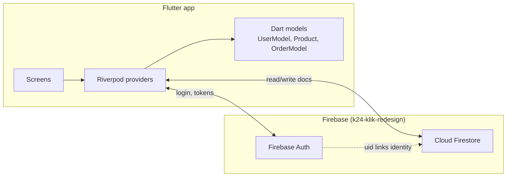
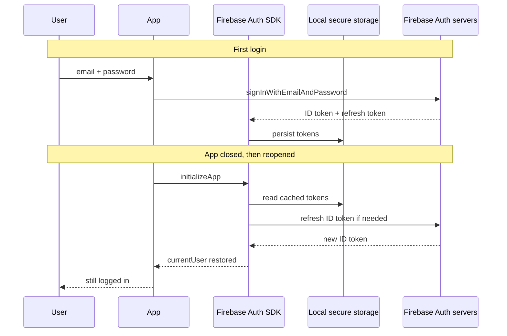

# Backend, Database, and Data Models

This document explains how the **K-24 Pharmacy** app (`k24_mvp`) connects to Firebase — Authentication, Cloud Firestore, and the Dart models in `lib/models/`. It describes how cloud data becomes typed objects in Flutter and how it reaches the UI.

For routing, see [1_Routing_and_Architecture.md](./1_Routing_and_Architecture.md).  
For Riverpod, see [2_State_Management_Riverpod.md](./2_State_Management_Riverpod.md).

---

## Table of Contents

1. [Big Picture: Our Backend Stack](#big-picture-our-backend-stack)
2. [What: Cloud Firestore and Our Data Models](#what-cloud-firestore-and-our-data-models)
3. [What: JSON Serialization (fromMap / toMap / fromFirestore)](#what-json-serialization-frommap--tomap--fromfirestore)
4. [How: Firebase Auth Keeps Users Logged In](#how-firebase-auth-keeps-users-logged-in)
5. [How: Data Travels from Firestore to the UI](#how-data-travels-from-firestore-to-the-ui)
6. [Our Firestore Schema](#our-firestore-schema)
7. [Why & Why Not: Firebase / NoSQL vs SQL](#why--why-not-firebase--nosql-vs-sql)
8. [When & Where: Cloud vs Cache, Token Storage](#when--where-cloud-vs-cache-token-storage)
9. [Examples: Translator Analogy for JSON Mapping](#examples-translator-analogy-for-json-mapping)
10. [Tips for Developers Working on This Project](#tips-for-developers-working-on-this-project)

---

## Big Picture: Our Backend Stack

This app does **not** run a custom server (no Node, Django, or Spring API in the repo). The "backend" is **Firebase** — a managed platform from Google:

| Service | Package | Role in K-24 |
|---------|---------|--------------|
| **Firebase Core** | `firebase_core` | Initializes the connection to project `k24-klik-redesign` |
| **Firebase Auth** | `firebase_auth` | Email/password sign-up, login, logout, session tokens |
| **Cloud Firestore** | `cloud_firestore` | NoSQL database for users, products, orders |

### Boot sequence

```dart
// main.dart
await Firebase.initializeApp(
  options: DefaultFirebaseOptions.currentPlatform,
);
```

`firebase_options.dart` (generated by FlutterFire CLI) supplies API keys and project IDs per platform (Android and Web are configured; iOS/desktop are not yet).



**Two separate stores work together:**

1. **Firebase Auth** — *Who* is this person? (email, password hash on server, `uid` on client)
2. **Firestore** — *What* do we know about them? (name, address, favorites, orders, products)

The link is the **`uid`**: the Firestore document `users/{uid}` uses the same ID Firebase Auth assigns at registration.

---

## What: Cloud Firestore and Our Data Models

### What is Cloud Firestore?

**Cloud Firestore** is a **NoSQL document database** in the cloud. Data is organized as:

```
Collection → Document → Fields (key-value pairs)
```

Think of it like nested JSON folders:

- A **collection** is a table-like group (`users`, `products`, `orders`)
- A **document** is one record (`users/abc123`)
- **Fields** are properties on that record (`name: "Bandar"`, `price: 12174`)

Unlike SQL rows in rigid tables, documents in the same collection can evolve independently (useful for MVP iteration).

### How our Dart models map to Firestore

Our models in `lib/models/` are **typed Dart classes** that mirror Firestore documents. They are **not** stored in Firestore themselves — they are the app's in-memory representation after reading (or before writing) cloud data.

| Dart model | Firestore collection | Document ID | Persisted? |
|------------|---------------------|-------------|------------|
| `UserModel` | `users` | Firebase Auth `uid` | Yes |
| `Product` | `products` | Product `id` (e.g. `"1"`) | Yes |
| `OrderModel` | `orders` | Auto-generated by `.add()` | Yes |
| `CartItem` | *(none)* | — | **No** — lives only in `cartProvider` RAM until checkout |

### UserModel ↔ `users/{uid}`

**Firestore document (example):**

```json
{
  "name": "Bandar Abdulrab",
  "email": "bandar@example.com",
  "phone": "08123456789",
  "address": "Jl. Example No. 1",
  "photoUrl": "",
  "favorites": ["1", "3", "5"]
}
```

**Dart object:**

```dart
UserModel(
  name: 'Bandar Abdulrab',
  phone: '08123456789',
  address: 'Jl. Example No. 1',
  photoUrl: '',
  favorites: ['1', '3', '5'],
)
```

Note: `email` is stored in Firestore at registration but is **not** a field on `UserModel` today — it lives in Firebase Auth's `User` object instead.

### Product ↔ `products/{id}`

**Firestore document:**

```json
{
  "name": "Panadol Biru",
  "category": "Obat Flu",
  "price": 12174,
  "description": "Obat untuk meredakan demam dan nyeri.",
  "imageUrl": "assets/images/panadol.png"
}
```

The document **ID** (`"1"`) becomes `Product.id` — it is not duplicated inside the field map.

### OrderModel ↔ `orders/{autoId}`

**Firestore document (written by `OrderNotifier.addOrder`):**

```json
{
  "uid": "firebase_user_uid_here",
  "items": [
    {
      "productId": "1",
      "name": "Panadol Biru",
      "price": 12174,
      "quantity": 2,
      "imageUrl": "assets/images/panadol.png"
    }
  ],
  "totalPrice": 49348,
  "deliveryMethod": "delivery",
  "paymentMethod": "transfer",
  "date": "<Firestore Timestamp>",
  "status": "Diproses"
}
```

Order **line items** are stored as an **array of maps** inside the order document — not as a separate `order_items` collection. That is a classic NoSQL denormalization choice: one read fetches the full order.

### CartItem — local-only model

`CartItem` wraps a `Product` + `quantity`. It never syncs to Firestore until checkout, when `order_provider` **snapshots** cart lines into the order's `items` array. If the user kills the app mid-shop, the cart is lost (by design in the current MVP).

---

## What: JSON Serialization (fromMap / toMap / fromFirestore)

**Serialization** means converting between two representations of the same data:

| Direction | Name | Purpose |
|-----------|------|---------|
| Cloud → Dart | **Deserialization** | `fromFirestore`, `fromMap` |
| Dart → Cloud | **Serialization** | `toMap`, `toFirestore` |

Firestore speaks in `Map<String, dynamic>` with special types (`Timestamp`, `FieldValue`). Dart speaks in `String`, `int`, `DateTime`, and custom classes. **Mapping code is the bridge.**

### Patterns in our codebase

#### `fromMap` — generic map to object

```dart
// user_model.dart
factory UserModel.fromMap(Map<String, dynamic> data) {
  return UserModel(
    name: _stringOrEmpty(data['name']),
    phone: _stringOrEmpty(data['phone']),
    // ...
  );
}
```

Used when you already have a plain map (or as a helper inside `fromFirestore`).

#### `fromFirestore` — document snapshot to object

```dart
factory UserModel.fromFirestore(DocumentSnapshot<Map<String, dynamic>> doc) {
  final data = doc.data();
  if (data == null) { /* empty user */ }
  return UserModel.fromMap(data);
}

factory Product.fromFirestore(DocumentSnapshot<Map<String, dynamic>> doc) {
  final data = doc.data()!;
  return Product(
    id: doc.id,  // ID comes from document path, not always from fields
    name: data['name'] as String,
    price: (data['price'] as num).toInt(),
    // ...
  );
}
```

`fromFirestore` also handles Firestore-specific types, e.g. `OrderModel` converts `Timestamp` → `DateTime`:

```dart
date: (data['date'] as Timestamp).toDate(),
```

#### `toMap` / `toFirestore` — object to cloud format

```dart
// user_model.dart
Map<String, dynamic> toMap() => {
  'name': name,
  'phone': phone,
  'address': address,
  'photoUrl': photoUrl,
  'favorites': favorites,
};

// product_model.dart
Map<String, dynamic> toFirestore() => {
  'name': name,
  'category': category,
  'price': price,
  'description': description,
  'imageUrl': imageUrl,
};
```

**Why two names (`toMap` vs `toFirestore`)?** Convention only — both produce maps for Firestore. `Product` uses `toFirestore` because it is only ever written to Firestore; `UserModel` uses `toMap` as a general export (registration writes fields inline in `auth_provider` rather than calling `toMap()` today).

### Why we hand-write mappers (no code generation)

This MVP uses **manual** `fromMap` / `fromFirestore` / `toFirestore` instead of packages like `json_serializable` or `freezed`. That keeps dependencies light and makes field mapping obvious for learners. Trade-off: you must update mappers when schema changes.

---

## How: Firebase Auth Keeps Users Logged In

### What happens at login

```dart
// auth_provider.dart
await _auth.signInWithEmailAndPassword(email: email, password: password);
```

1. App sends email + password to **Firebase Auth servers** (over HTTPS).
2. Server verifies credentials.
3. Server returns a **ID token** (short-lived, ~1 hour) and a **refresh token** (long-lived).
4. The Firebase SDK stores these tokens **locally on the device** (see [Token storage](#where-are-firebase-security-tokens-stored)).
5. `FirebaseAuth.instance.currentUser` becomes non-null.
6. `authStateChanges()` stream emits the `User` object.
7. `UserNotifier` hears the change and loads `users/{uid}` from Firestore.

### What happens when the user closes the app

The user does **not** need to log in again every time because:

1. **Tokens persist on disk** — The `firebase_auth` SDK saves the refresh token in platform-specific secure storage before the app exits.
2. **On next launch** — `Firebase.initializeApp()` runs, then the Auth SDK **restores** the cached session from disk.
3. **Silent refresh** — If the ID token expired while the app was closed, the SDK uses the refresh token to obtain a new ID token from Google's servers (no password prompt).
4. **`authStateChanges()` fires** — Emits the restored `User`, and providers like `UserNotifier` / `OrderNotifier` reload Firestore data.



### What logout does

```dart
await _auth.signOut();
```

Clears local tokens and sets `currentUser` to null. `UserNotifier` resets to an empty `UserModel`; `OrderNotifier` clears orders.

### Auth vs profile — important split

| Data | Where it lives |
|------|----------------|
| Email, password (hash), `uid` | **Firebase Auth** (managed service) |
| Name, phone, address, favorites | **Firestore** `users/{uid}` |

Registration creates **both** in one flow:

```dart
final credential = await _auth.createUserWithEmailAndPassword(...);
await _firestore.collection('users').doc(uid).set({ ... });
```

---

## How: Data Travels from Firestore to the UI

End-to-end path for **products** (real-time catalog):

```
Cloud Firestore (products collection)
        ↓  gRPC / WebSocket sync
Firestore SDK local cache (on device)
        ↓  .snapshots() stream
productProvider (StreamProvider)
        ↓  Product.fromFirestore per document
AsyncValue<List<Product>>
        ↓  ref.watch in HomeScreen
productsAsync.when(loading / error / data)
        ↓  build widgets
Product cards on screen
```

### Step-by-step (products on HomeScreen)

1. **`productProvider`** subscribes to `firestore.collection('products').snapshots()`.
2. On first access, **`seedProductsIfEmpty`** may write seed products if the collection is empty (MVP bootstrap).
3. Each snapshot delivers `QuerySnapshot` with document list.
4. Each doc is mapped: `Product.fromFirestore(doc)`.
5. Riverpod exposes `AsyncValue<List<Product>>` (loading → data or error).
6. **`HomeScreen`** uses `ref.watch(productProvider)` and `productsAsync.when(...)`.
7. When Firestore data changes (admin adds a product, another client edits), a new snapshot fires → provider updates → UI rebuilds.

### Step-by-step (user profile)

1. User logs in → `UserNotifier` listens to `authStateChanges()`.
2. On user present, **`_loadUser(uid)`** runs `users/{uid}.get()` (one-shot read).
3. `UserModel.fromFirestore(doc)` builds the model.
4. `userProvider` state updates → profile/checkout screens `ref.watch(userProvider)` rebuild.

### Step-by-step (orders)

1. `OrderNotifier` listens to auth, then subscribes to:

```dart
_firestore.collection('orders').where('uid', isEqualTo: uid).snapshots()
```

2. Each matching order doc → `OrderModel.fromFirestore`.
3. List sorted by date → `orderProvider` state → `OrdersScreen` displays.

### Step-by-step (checkout write path)

1. User confirms checkout → `orderProvider.notifier.addOrder(...)`.
2. Cart `CartItem`s are **serialized inline** to maps (not via a `CartItem.toMap()` — mapping is in the provider).
3. `orders.add({ ... })` creates a new Firestore document.
4. Firestore replicates to cloud; the orders snapshot listener picks it up.
5. `OrdersScreen` updates automatically; cart is cleared locally.

### Read vs write patterns in our app

| Data | Read pattern | Write pattern |
|------|--------------|---------------|
| Products | `snapshots()` stream | Seed scripts / `appendNewProducts` (dev) |
| User profile | `.get()` on login | `.update()` on profile/address/favorites |
| Orders | `snapshots()` filtered by `uid` | `.add()` on checkout |
| Favorites | Via `userProvider` + `favoriteProvider` | `FieldValue.arrayUnion` / `arrayRemove` |

---

## Our Firestore Schema

```
k24-klik-redesign (Firebase project)
│
├── Firebase Auth
│     └── users (auth accounts: email, uid, password hash)
│
└── Cloud Firestore
      ├── users/{uid}
      │     ├── name: string
      │     ├── email: string
      │     ├── phone: string
      │     ├── address: string
      │     ├── photoUrl: string
      │     └── favorites: array<string>  (product IDs)
      │
      ├── products/{productId}
      │     ├── name: string
      │     ├── category: string
      │     ├── price: number
      │     ├── description: string
      │     └── imageUrl: string
      │
      └── orders/{orderId}
            ├── uid: string
            ├── items: array<map>
            ├── totalPrice: number
            ├── deliveryMethod: string
            ├── paymentMethod: string
            ├── date: timestamp
            └── status: string
```

**Security rules:** This repo does not include a `firestore.rules` file. In production, you must add rules so users can only read/write their own `users/{uid}` and `orders` where `uid` matches `request.auth.uid`. Without rules, the Firebase console default (or test mode) may be overly permissive — treat that as a known MVP gap.

---

## Why & Why Not: Firebase / NoSQL vs SQL

### Why we use Firebase + Firestore

| Reason | Benefit for K-24 MVP |
|--------|----------------------|
| **No custom backend** | Faster prototype — auth + database + hosting config in one ecosystem |
| **Real-time sync** | `snapshots()` updates product list and orders without manual polling |
| **Flutter-first SDKs** | `firebase_auth`, `cloud_firestore` integrate cleanly with our Riverpod providers |
| **Scales with traffic** | Google manages servers; good for uncertain MVP load |
| **Offline cache built-in** | Firestore SDK caches reads on mobile (see below) |
| **Flexible schema** | Order `items` embedded as array — no JOIN queries needed for display |

### Why not SQL (SQLite local or PostgreSQL server)?

| SQL strength | Why we did not choose it for this MVP |
|--------------|--------------------------------------|
| Strict schema, relations, JOINs | Pharmacy inventory with suppliers, batches, prescriptions, and audits benefits from SQL — but that is **more complexity than this app needs now** |
| SQLite on device | Great offline-first local DB, but no built-in multi-user sync — you'd still need a sync API |
| PostgreSQL (self-hosted or Cloud SQL) | Requires writing and deploying a REST/GraphQL API, auth middleware, and ops — slower for a student/MVP timeline |
| Complex reporting | SQL excels at `SUM(orders) GROUP BY month`; Firestore aggregations are more limited |

### NoSQL vs SQL for a pharmacy app

| Concern | NoSQL (Firestore) — our approach | SQL (e.g. PostgreSQL) |
|---------|----------------------------------|------------------------|
| Product catalog | Collection of product docs — **fits well** | `products` table — also natural |
| Shopping cart (session) | In-memory Riverpod — **not in DB** | Could use `cart_items` table with session/user FK |
| Orders + line items | Nested `items` array in one doc — **simple reads** | `orders` + `order_items` tables — **normalized**, better for refunds/partial updates |
| User favorites | Array on user doc — **fine for small lists** | Junction table `user_favorites` — better at scale |
| Prescription compliance, stock batches, expiry | Awkward in document model | **Relational model fits regulation and inventory** |
| Real-time mobile UI | **Native listener support** | Needs extra layer (WebSockets, polling) |
| Offline mobile | **Built-in cache** | SQLite local + sync logic you build |

**Verdict for K-24 today:** Firestore is the right trade-off for a **delivery-pharmacy MVP** focused on catalog, cart, checkout, and order history. If the product grows into regulated inventory, pharmacist workflows, or heavy analytics, **adding or migrating to SQL** for those domains would make sense while keeping Firebase Auth.

### Similarities (both are databases)

- Store persistent data
- Need security/access control
- Require thoughtful data modeling
- Map to objects in app code (ORM / manual mappers)

### Differences (what you feel as a developer)

| | Firestore (NoSQL) | SQL |
|--|-------------------|-----|
| Unit of thought | Document / collection | Table / row |
| Relationships | Denormalize or duplicate | Foreign keys, JOINs |
| Queries | Limited compound queries; indexes required | Rich ad-hoc SQL |
| Schema changes | Add fields anytime | Migrations (`ALTER TABLE`) |

---

## When & Where: Cloud vs Cache, Token Storage

### When does the app fetch from the cloud vs use cache?

The **Firestore SDK** maintains a **local persistence layer** on mobile (enabled by default on Android/iOS). You rarely choose "cache vs cloud" manually — the SDK merges both.

| Situation | Typical behavior |
|-----------|------------------|
| **First launch, online** | Fetches from cloud; populates local cache |
| **Return visit, online** | Often shows **cached data immediately**, then syncs diffs from cloud |
| **Offline** | Reads/writes go to local cache; writes queue and sync when online |
| **`.get()` one-shot** | Can be configured with `GetOptions(source: Source.cache)` or `server` — **we use defaults** |
| **`.snapshots()` listener** | Emits on cache **and** on server updates — why orders/products feel "live" |

**In our app specifically:**

| Feature | Cloud fetch timing | Cache involvement |
|---------|-------------------|-------------------|
| Products (`productProvider`) | On subscribe + every remote change | SDK serves cached snapshot first when available |
| User profile (`_loadUser`) | On login / auth restore | Previous session's user may flash empty until `.get()` completes |
| Orders (`orderProvider`) | On login + live updates | Cached orders may appear before network round-trip completes |
| Cart | **Never** hits Firestore until checkout | RAM only (`cartProvider`) |
| Auth session | Token refresh talks to Auth servers | **Persisted tokens** restore user without re-entering password |

### Where are Firebase security tokens stored?

Our Dart code **never** writes tokens to Firestore or Riverpod. The **`firebase_auth` native SDK** handles storage:

| Platform | Storage location (managed by SDK) |
|----------|--------------------------------|
| **Android** | App-private storage; tokens encrypted/managed internally by Firebase Auth (not accessible to other apps) |
| **Web** | IndexedDB / local persistence (browser); subject to browser storage policies |
| **iOS** (not configured yet) | Keychain (when you add iOS via FlutterFire) |

**What is stored:**

- **Refresh token** — long-lived; proves the device may request new ID tokens
- **ID token (JWT)** — short-lived; proves who the user is to Firestore and other Firebase services

When Firestore reads/writes run, the SDK attaches the current user's ID token. Firestore security rules (when you add them) validate that token server-side.

**What is NOT stored in our repo:**

- Passwords (only sent over TLS at login; hash lives on Auth servers)
- Refresh tokens in `shared_preferences` by our code (SDK owns that)

---

## Examples: Translator Analogy for JSON Mapping

Imagine two people who speak different languages:

- **Firestore** speaks **"Firestore-ish"** — maps with string keys, `Timestamp` for dates, nested lists of maps.
- **Your Flutter app** speaks **"Dart-ish"** — `UserModel`, `DateTime`, `Product` classes with typed fields.

They cannot hand each other objects directly. They need a **translator**.

| Role | In our app |
|------|------------|
| Firestore document | A paragraph written in Firestore-ish |
| `fromFirestore` / `fromMap` | Translator reads Firestore-ish → speaks Dart-ish to the app |
| `toMap` / `toFirestore` | Translator takes Dart-ish → writes Firestore-ish for storage |
| `Product.fromFirestore` | "The word `price` in their document means an `int` in our `Product` class" |
| `(data['date'] as Timestamp).toDate()` | "They say `Timestamp`; we say `DateTime` — convert the unit" |
| `doc.id` for `Product.id` | "Their document **filename** is our product ID, even if the paragraph body doesn't repeat it" |

### Mini conversation (order date)

**Firestore sends:**

```json
{ "date": { "_seconds": 1718208000, "_nanoseconds": 0 } }
```

**Translator (`OrderModel.fromFirestore`):**

> "In Dart, that becomes `DateTime(2024, 6, 12, ...)`"

**UI speaks:**

> "Show `12 Jun 2024` to the user"

Without the translator, you would pass raw maps into widgets and every screen would need to know Firestore's format — brittle and repetitive. **Models + serialization centralize the translation once.**

---

## Tips for Developers Working on This Project

1. **Adding a field to User or Product** — Update the model, `fromMap`/`fromFirestore`, write path (`toMap`/`toFirestore` or inline `.set()`), and any UI that displays it.

2. **New Firestore collection** — Add a model with `fromFirestore`, a provider (StreamProvider for live lists, StateNotifier for read/write), and security rules before production.

3. **Keep Auth uid as the join key** — Any user-owned document should include `uid` and rules should enforce `request.auth.uid == uid`.

4. **Orders embed items** — Changing line-item structure requires updating `OrderNotifier.addOrder`, `OrderModel.fromFirestore`, and order display widgets together.

5. **Cart is ephemeral** — To persist cart across sessions, add local storage or a `carts/{uid}` Firestore doc (NoSQL) or SQL table — not present today.

6. **Configure iOS/desktop** — Run FlutterFire CLI if you expand beyond Android/Web; `firebase_options.dart` currently throws for unsupported platforms.

7. **Add `firestore.rules`** — Before public release, use the Firebase console or CLI to deploy rules; audit with security in mind.

8. **`authStateProvider`** — Already defined but unused in screens; wire it to go_router `redirect` for automatic login gating.

---

## Summary

- **Backend** = Firebase Auth (identity) + Cloud Firestore (user profile, products, orders) in project `k24-klik-redesign`.
- **Models** (`UserModel`, `Product`, `OrderModel`) are typed Dart views of Firestore documents; `CartItem` is local-only until checkout.
- **Serialization** (`fromMap`, `fromFirestore`, `toMap`, `toFirestore`) translates between Firestore maps and Dart objects — like a bilingual translator.
- **Auth persistence** = refresh + ID tokens stored on-device by the Firebase SDK; silent refresh on app reopen.
- **Data to UI** = Firestore SDK (cache + sync) → providers → `ref.watch` → widgets; products and orders use real-time `snapshots()`.
- **NoSQL fit** = fast MVP, real-time mobile, flexible documents; **SQL** would win for heavy inventory, compliance, and complex reporting as the pharmacy product matures.
- **Cache vs cloud** = Firestore SDK blends both; cart is RAM-only; tokens live in platform secure storage managed by `firebase_auth`.

Understanding the translator layer and the Auth/Firestore split is the foundation for safely extending the K-24 data model.
